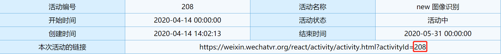

# 小程序插件使用文档

功能：包括扫描、图像识别（一张图片和多张图片）、识别后展示[动画、视频、商家外链]
识别图片以及其他宣传物料需要在我们的AR平台配置。

# 具体使用流程：
1. 在"https://www.wechatvr.org"根据网站提示来配置活动，可以根据活动需求配置一对一或者多对多活动。

2. 配置待识别图片，需上传png图像，最好是300*300尺寸大小。

3. 配置完成后，拿到activityId的值：



4. 在需要添加插件的页面添加组件按钮navigator,url的值为`plugin://AR-plugin/AR-page?activityId=${activityId}`

- 官网示例："plugin-private://PLUGIN_APPID/PATH/TO/PAGE"

5. 如果有跳转商家链接的需求，在小程序pages下新建一个页面，名字为myLink,里面文件名也为myLink，其中，里面的代码如下：
```
//wxml
<view wx:if="{{!link}}"></view>
<web-view wx:else src="{{link}}" binderror="error" bindload="res"></web-view>
//js
Page({
  data:{
    link: null
  },
  onLoad: function(options){
    this.setData({
      link:options.link
    })
  }
})
```

另外注意将您想跳转的商家链接配置webview白名单。

6. 如果需要统计pv，navigator组件可以这样写：（传query:ifNeedPv=true）
```
<navigator id="nav" url="{{'plugin://AR-plugin/AR-page?activityId=226&openId='+openid}}">
  your name
</navigator>
```

开发者小程序页面需要在相应的index.js里面的onLoad加上
```
wx.login({
      success (res) { 
        wx.request({
          url: `自己的后台接口?code=${res.code}`,
          success (res) {
            console.log(res.data)
            that.setData({
              openid: res.data.openid
            });
            }
        })        
        }
    });
    ```